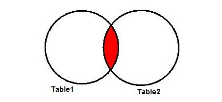
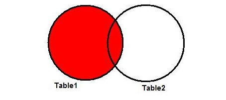
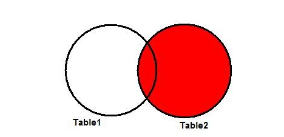

INNER JOIN
* пересечение – это результат операции inner join

OUTER LEFT JOIN
* проводится проверка на соответствие условия соединения;
* если оно выполняется – строчка из второй прибавляется к первой таблице
* когда значение отсутствует в правой таблице, поля отображаются в виде null;
* если выставленный параметр слияния не выполняется, строчки отбрасываются.

OUTER RIGHT JOIN
* возвращаются все строки из правой таблицы
* дополнительно выводятся строчки левой таблицы, которые имеют с правой одинаковые значения;
* если поле из правой отсутствует в левой, соответствующие поля имеют значение null.

